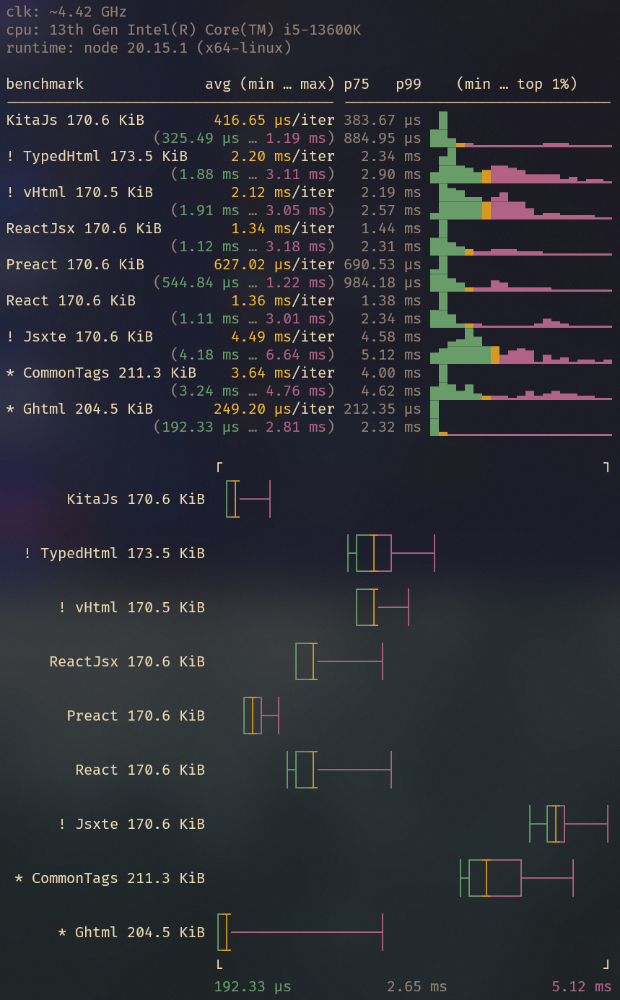

<h1>Benchmark</h1>

- [Results](#results)
- [Versions](#versions)
- [Information](#information)
- [About KitaJS/Html](#about-kitajshtml)
- [Runtime Inconsistencies](#runtime-inconsistencies)

## Results

```
Sizes are the final html output based on the same input.

!) Are jsx runtimes that produces different output from React for the same input ⚠️

*) Are template engines, which usually lacks syntax highlighting and intellisense:
   https://github.com/kitajs/html/blob/master/benchmarks/templates/normal.tsx
```



## Versions

```json
{
  "@kitajs/html": "4.2.4",
  "common-tags": "1.8.2",
  "ghtml": "3.0.10",
  "html-minifier": "4.0.0",
  "jsxte": "3.3.1",
  "mitata": "1.0.10",
  "nano-jsx": "0.1.0",
  "preact-render-to-string": "6.5.11",
  "react-dom": "18.3.1"
}
```

## Information

The `RealWorldPage` benchmark is the most meaningful since it represents a realistic
workload scenario. _Other benchmarks serve specific purposes, such as measuring the speed
of creating individual elements or handling attribute injection and escaping._

It's essential to emphasize that all benchmarks aim for impartiality. Any perceived bias
towards a particular library should be promptly reported, and corrective actions will be
taken swiftly.

We are committed to addressing any discrepancies or unfairness in the benchmarks promptly.
Updates reflecting corrections will be publicly shared as soon as they are available.

Feel free to reach out if you have any concerns or suggestions for improving the
benchmarking process. Your feedback is invaluable in ensuring the fairness and accuracy of
our comparisons.

Also, feel free to contribute benchmarks for any library you're interested in by opening a
pull request (PR). If you need assistance or wish to suggest a library for benchmarking,
don't hesitate to open an issue.

## About KitaJS/Html

KitaJS/Html prioritizes performance while maintaining a user-friendly and intuitive API.
Its design ensures not only speed but also a seamless developer experience (DX). Since
this code may run on every request, its primary objective is speed, with a secondary focus
on maintaining developer productivity.

The library adheres to the JSX standard for its API, shielding users from the complexities
of its internal workings. This approach allows us to optimize the underlying
implementation extensively, including function inlining, to achieve maximum performance.

## Runtime Inconsistencies

I tried multiple formatters and minifiers to ensure the html output of all runtimes is
consistent, however vhtml and common-tags aren't consistent at all, with weird behaviors
like adding spaces between components and rendering `0` as an empty string...

As react is by far the JSX standard these days, **KitaJS/Html is only required to produce
the same output as ReactDOMServer.renderToStaticMarkup**.

To be sure we are emitting a similar output and none of the libraries are emitting broken
HTML, a realWorldPage is rendered and stored at the [samples](./runner/samples) directory.
